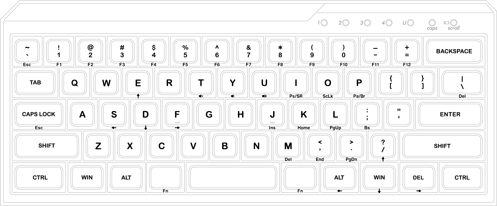
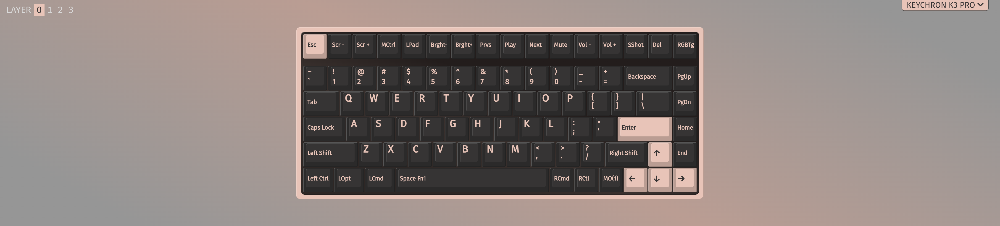
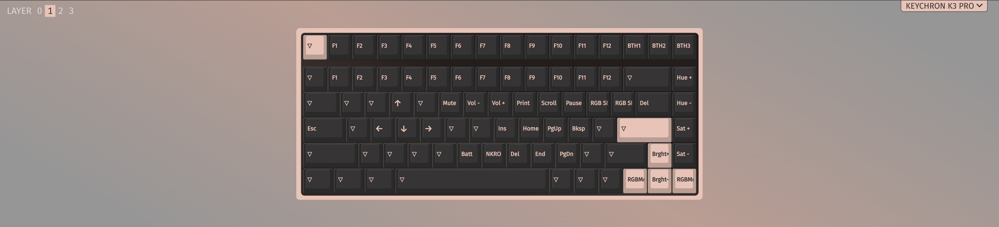
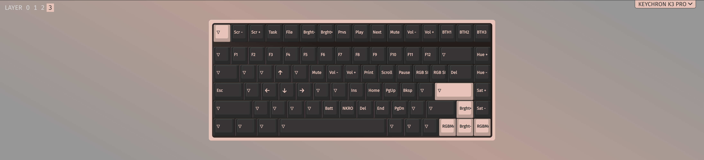

# Keychron K3 Pro Config

## Config file types

There are two types of json config files:

- The keymap json: it's meant for VIA to load, don't modify it;
- The layout json: key layout definitions.

##  MINILA-R Like Layout

Since `Majestouch MINILA-R Convertible` is my working keyboard mostly and I really get used to it, so I configured the layout of my K3P to a similar one. Below is a figure of the original MINILA-R layout:

With a few adjustments, the K3P MINILA-R like layout looks like this:

- Layer0:

- Layer1:

- Layer2:

- Layer3:

Feel free to use or modify it for your convinience.